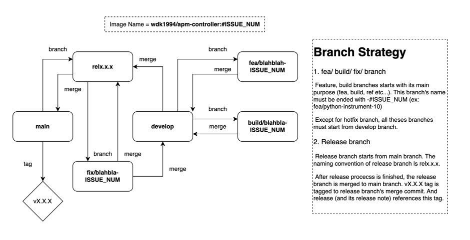

# Development

This document describes how to setup a development environment for the project and initial setup.

## Kubebuilder

The project uses [kubebuilder](https://book.kubebuilder.io/) to generate the boilerplate code for the operator. The
following steps are required to setup the development environment.

### Install kubebuilder

```shell
# download kubebuilder and install locally.
curl -L -o kubebuilder "https://go.kubebuilder.io/dl/latest/$(go env GOOS)/$(go env GOARCH)"
chmod +x kubebuilder && mv kubebuilder /usr/local/bin/
```

### Create a new project

```shell
kubebuilder init --domain ogas.kr --repo github.com/DDnK-dev/apm-instrumentaion-operator --license apache2
kubebuilder create api --version v1 --group apm --kind Instrumentation
kubebuilder create webhook --version v1 --group apm --kind Instrumentation --defaulting --programmatic-validation
```

### Implementation points

- Define the `Instrumentation` CRD spec at `api/v1/instrumentation_types.go`
- Implement the `defaulter` and `validator` at `api/v1/instrumentation_types.go`
- Implement the `Instrumentation` webhook logic at `api/v1/instrumentation_webhook.go`
- Add custom webhook to `main.go` if needed.
- Generate Custom resource spec document using command `make gen-doc`

### Branch Strategy

This project follows common git-flow strategy



Image tag naming strategy is as follows:

- `latest`: The latest image tag for the main branch.
- `develop` : The latest image tag for the develop branch.
- `vX.Y.Z` : The release tag for the branch `relX.Y.Z`
- `#ISSUE_NUMBER` : The image tag for the feature branch end with the issue number.

